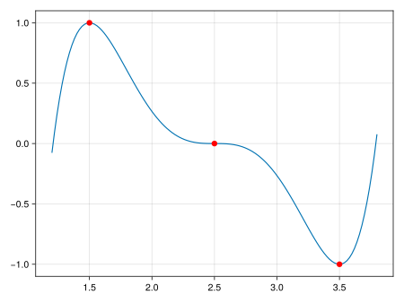

# HermiteInterpolation

[](https://kbarros.github.io/HermiteInterpolation.jl/stable/)
[](https://kbarros.github.io/HermiteInterpolation.jl/dev/)
[](https://github.com/kbarros/HermiteInterpolation.jl/actions/workflows/CI.yml?query=branch%3Amain)
[](https://codecov.io/gh/kbarros/HermiteInterpolation.jl)

This Julia package implements [Hermite interpolation](https://en.wikipedia.org/wiki/Hermite_interpolation). It takes a list of interpolation points $[x_1, x_2, …, x_n]$, along with data for a
function $y(x)$ and its derivatives $d^n y/dx^n$ up to some order $n = 1, …, m-1$. Fitting yields the unique polynomial less than order $m n$ that exactly matches the provided data. Without derivatives, the method reduces to Lagrange interpolation.

Use `fit` to build an interpolation function:

```jl
x = [1.5, 2.5, 3.5]
y = [1, 0, -1]
yp = [0, 0, 0]

import HermiteInterpolation
f = HermiteInterpolation.fit(x, y, yp)

@assert f(1.5) ≈ 1.0
```

Verify visually that the resulting curve matches the sample data for both $y$ and $y'$:

```jl
using CairoMakie
x_range = 1.2:0.02:3.8
lines(x_range, f.(x_range))
plot!(x, y; markersize=12, color=:red)
save("hermite_fit.svg", current_figure())
```

</img>


The fitting function `f` can be evaluated over any type that supports addition and multiplication. For example, with a symbolic variable `X` from [DynamicPolynomials](https://github.com/JuliaAlgebra/DynamicPolynomials.jl), one can obtain the explicit interpolation polynomial and its derivative:

```jl
using DynamicPolynomials
@polyvar X

f_sym = f(X)
# -107.421875 + 246.09375X - 215.625X² + 91.25X³ - 18.75X⁴ + 1.5X⁵

fp_sym = differentiate(f_sym, X)
# 246.09375 - 431.25X + 273.75X² - 75.0X³ + 7.5X⁴

@assert f_sym(1.5) ≈ 1
@assert fp_sym(1.5) ≈ 0
```

